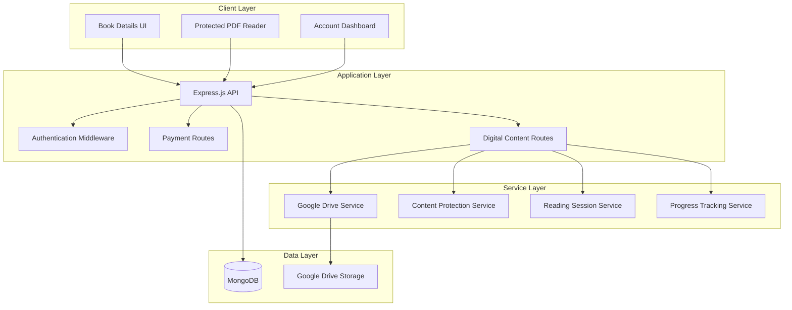

# Online Reading System Design Document

## Overview

The Online Reading System extends the existing book store platform to offer digital reading experiences at reduced pricing. The system integrates with Google Drive for secure PDF storage, implements robust content protection mechanisms, and provides seamless payment integration with the existing Razorpay infrastructure. The design prioritizes content security while maintaining user experience and leverages the existing user authentication, order management, and commission systems.

## Architecture

### High-Level Architecture



### Integration Points

- **Existing Book Model**: Extended with digital content fields
- **Existing Order System**: Enhanced to handle digital purchases
- **Existing Payment Flow**: Modified to support dual pricing
- **Existing User Authentication**: Leveraged for reading session management
- **Existing Commission System**: Applied to digital sales

## Components and Interfaces

### 1. Enhanced Book Model

```javascript
// Extended Book Schema
{
  // Existing fields...
  
  // Digital Content Fields
  digitalContent: {
    available: Boolean,
    googleDriveFileId: String,
    onlinePrice: Number,
    previewPages: Number
  },
  
  // Pricing
  physicalPrice: Number, // Renamed from 'price'
  onlinePrice: Number    // New field for digital pricing
}
```

### 2. Digital Purchase Model

```javascript
// DigitalPurchase Schema
{
  userId: ObjectId,
  bookId: ObjectId,
  orderId: ObjectId,
  purchaseDate: Date,
  accessExpiryDate: Date,
  readingProgress: {
    currentPage: Number,
    totalPages: Number,
    lastReadAt: Date
  },
  accessCount: Number,
  maxAccessCount: Number
}
```

### 3. Reading Session Model

```javascript
// ReadingSession Schema
{
  userId: ObjectId,
  digitalPurchaseId: ObjectId,
  sessionToken: String,
  startTime: Date,
  lastActivity: Date,
  expiresAt: Date,
  ipAddress: String,
  userAgent: String,
  isActive: Boolean
}
```

### 4. Google Drive Service Interface

```javascript
class GoogleDriveService {
  async uploadPDF(filePath, bookId)
  async getFileStream(fileId, sessionToken)
  async deleteFile(fileId)
  async verifyFileExists(fileId)
  async getFileMetadata(fileId)
}
```

### 5. Content Protection Service Interface

```javascript
class ContentProtectionService {
  async createProtectedViewer(fileStream, sessionToken, watermarkData)
  async validateSession(sessionToken)
  async generateWatermark(userId, bookTitle)
  async logSecurityEvent(eventType, userId, details)
}
```

## Data Models

### Enhanced Book Model

```javascript
const digitalBookSchema = new mongoose.Schema({
  // Existing book fields...
  title: String,
  author: String,
  description: String,
  cover_image: String,
  
  // Pricing Structure
  physicalPrice: { type: Number, required: true },
  onlinePrice: { type: Number, default: null },
  
  // Digital Content Configuration
  digitalContent: {
    available: { type: Boolean, default: false },
    googleDriveFileId: { type: String, default: null },
    fileSize: { type: Number, default: 0 }, // in bytes
    totalPages: { type: Number, default: 0 },
    previewPages: { type: Number, default: 5 },
    uploadedAt: { type: Date, default: null },
    lastVerified: { type: Date, default: null }
  },
  
  // Access Control
  digitalAccess: {
    maxConcurrentSessions: { type: Number, default: 2 },
    sessionDurationHours: { type: Number, default: 24 },
    maxAccessCount: { type: Number, default: 100 }
  }
});
```

### Digital Purchase Model

```javascript
const digitalPurchaseSchema = new mongoose.Schema({
  userId: { type: mongoose.Schema.Types.ObjectId, ref: 'User', required: true },
  bookId: { type: mongoose.Schema.Types.ObjectId, ref: 'Book', required: true },
  orderId: { type: mongoose.Schema.Types.ObjectId, ref: 'Order', required: true },
  
  purchaseDate: { type: Date, default: Date.now },
  accessExpiryDate: { type: Date, default: null }, // null = lifetime access
  
  readingProgress: {
    currentPage: { type: Number, default: 1 },
    totalPages: { type: Number, default: 0 },
    lastReadAt: { type: Date, default: null },
    bookmarkedPages: [{ type: Number }]
  },
  
  accessStats: {
    totalAccessCount: { type: Number, default: 0 },
    maxAccessCount: { type: Number, default: 100 },
    firstAccessAt: { type: Date, default: null },
    lastAccessAt: { type: Date, default: null }
  },
  
  isActive: { type: Boolean, default: true }
}, { timestamps: true });
```

### Reading Session Model

```javascript
const readingSessionSchema = new mongoose.Schema({
  userId: { type: mongoose.Schema.Types.ObjectId, ref: 'User', required: true },
  digitalPurchaseId: { type: mongoose.Schema.Types.ObjectId, ref: 'DigitalPurchase', required: true },
  
  sessionToken: { type: String, required: true, unique: true },
  startTime: { type: Date, default: Date.now },
  lastActivity: { type: Date, default: Date.now },
  expiresAt: { type: Date, required: true },
  
  clientInfo: {
    ipAddress: { type: String, required: true },
    userAgent: { type: String, required: true },
    deviceFingerprint: { type: String, default: null }
  },
  
  securityFlags: {
    suspiciousActivity: { type: Boolean, default: false },
    multipleDevices: { type: Boolean, default: false },
    rapidPageTurning: { type: Boolean, default: false }
  },
  
  isActive: { type: Boolean, default: true }
}, { timestamps: true });
```

## Correctness Properties

*A property is a characteristic or behavior that should hold true across all valid executions of a system-essentially, a formal statement about what the system should do. Properties serve as the bridge between human-readable specifications and machine-verifiable correctness guarantees.*

<function_calls>
<invoke name="prework">
<parameter name="featureName">online-reading-system
##
# Property Reflection

After reviewing all properties identified in the prework analysis, several opportunities for consolidation and optimization have been identified:

**Redundancy Analysis:**
- Properties 1.1, 1.2, and 1.3 can be combined into a comprehensive UI behavior property
- Properties 3.1, 3.2, 3.3, and 3.4 can be consolidated into a single content protection property
- Properties 7.1, 7.2, 7.3, and 7.4 can be merged into a comprehensive progress management property
- Properties 5.1 and 5.2 can be combined into a secure content delivery property

**Consolidated Properties:**

Property 1: Digital content UI consistency
*For any* book with available digital content, the book details page should display both physical and digital purchase options with correct pricing, and purchased digital books should appear in the user's library with appropriate reading options
**Validates: Requirements 1.1, 1.2, 1.3**

Property 2: Digital purchase validation
*For any* book purchase attempt, the system should only allow digital purchases for books with available digital content and prevent purchases for books without digital content
**Validates: Requirements 1.4**

Property 3: Digital purchase completion
*For any* completed digital purchase, the system should record the transaction and create a valid reading session
**Validates: Requirements 1.5**

Property 4: Admin digital content management
*For any* book with uploaded PDF content, enabling digital availability should make the option visible to customers, and disabling should hide new purchases while preserving existing access
**Validates: Requirements 2.1, 2.3, 2.4**

Property 5: Digital pricing validation
*For any* book with digital content, the online reading price should be less than or equal to the physical book price
**Validates: Requirements 2.2**

Property 6: Digital sales reporting
*For any* digital purchase transaction, it should appear in the admin digital sales reports with correct statistics and revenue data
**Validates: Requirements 2.5**

Property 7: Content protection comprehensive
*For any* protected PDF viewer session, right-click, text selection, printing, and download options should all be disabled, and content should be rendered using canvas-based methods
**Validates: Requirements 3.1, 3.2, 3.3, 3.4, 4.3**

Property 8: Progress persistence comprehensive
*For any* reading session, page navigation should automatically save progress, returning to the book should restore position, progress should be securely stored with the user account, and should synchronize across multiple devices
**Validates: Requirements 3.5, 7.1, 7.2, 7.3, 7.4**

Property 9: Session watermarking
*For any* active reading session, watermarks containing customer identification information should be displayed on the content
**Validates: Requirements 4.4**

Property 10: Security event logging
*For any* unauthorized access attempt, security events should be logged and access should be blocked
**Validates: Requirements 4.5**

Property 11: Secure content delivery
*For any* PDF content request, the system should use authenticated API calls without exposing public URLs and stream content through the application server rather than direct client access
**Validates: Requirements 5.1, 5.2**

Property 12: Google Drive error handling
*For any* Google Drive API limit scenario, the system should implement appropriate retry mechanisms and error handling
**Validates: Requirements 5.3**

Property 13: File organization
*For any* uploaded PDF file, it should be organized in structured folders with proper permissions
**Validates: Requirements 5.4**

Property 14: File integrity verification
*For any* system backup operation, mechanisms should be available to verify file integrity and availability
**Validates: Requirements 5.5**

Property 15: Session authentication
*For any* reading session access, the system should authenticate the user and verify purchase history
**Validates: Requirements 6.1**

Property 16: Session expiration handling
*For any* expired reading session, the system should require re-authentication before allowing continued access
**Validates: Requirements 6.2**

Property 17: Concurrent session limits
*For any* user accessing content from multiple devices, the system should limit concurrent sessions to prevent account sharing
**Validates: Requirements 6.3**

Property 18: Suspicious activity detection
*For any* detected suspicious activity, the reading session should be terminated and require additional verification
**Validates: Requirements 6.4**

Property 19: Account suspension handling
*For any* suspended customer account, access to all digital content should be immediately revoked
**Validates: Requirements 6.5**

Property 20: Progress error handling
*For any* corrupted progress data, the system should gracefully handle errors and allow manual position setting
**Validates: Requirements 7.5**

## Error Handling

### Content Access Errors

- **File Not Found**: Graceful degradation with user notification and support contact
- **Session Expired**: Automatic re-authentication flow with progress preservation
- **Concurrent Session Limit**: Clear messaging with option to terminate other sessions
- **Unauthorized Access**: Immediate session termination with security logging

### Google Drive Integration Errors

- **API Rate Limits**: Exponential backoff retry mechanism with user notification
- **File Corruption**: Automatic integrity verification with admin notification
- **Network Failures**: Offline mode with cached content where possible
- **Authentication Failures**: Service account token refresh with fallback mechanisms

### Payment Integration Errors

- **Duplicate Purchase**: Prevention with existing purchase detection
- **Payment Failures**: Integration with existing Razorpay error handling
- **Pricing Inconsistencies**: Validation at multiple layers with admin alerts

## Testing Strategy

### Dual Testing Approach

The Online Reading System requires both unit testing and property-based testing to ensure comprehensive coverage:

**Unit Testing Focus:**
- Specific examples of digital purchase flows
- Edge cases for session management
- Integration points with existing systems
- Error conditions and recovery scenarios

**Property-Based Testing Focus:**
- Universal properties that should hold across all digital content
- Security properties that must be maintained regardless of input
- Data consistency properties across user sessions
- Content protection properties across different browsers and devices

### Property-Based Testing Configuration

**Testing Framework**: fast-check (JavaScript property-based testing library)
**Minimum Iterations**: 100 iterations per property test
**Test Tagging**: Each property-based test must include a comment with the format:
`**Feature: online-reading-system, Property {number}: {property_text}**`

### Unit Testing Configuration

**Testing Framework**: Jest (existing project framework)
**Coverage Requirements**: Minimum 80% code coverage for new digital content modules
**Integration Testing**: Focus on Google Drive service integration and payment flow integration

### Test Data Management

- **Mock Google Drive**: Use service account with test folder for development
- **Test PDF Files**: Standardized test documents with known page counts
- **User Test Data**: Automated generation of test users with various purchase histories
- **Session Simulation**: Automated browser testing for content protection verification

### Security Testing

- **Penetration Testing**: Manual testing of content protection mechanisms
- **Session Security**: Automated testing of session hijacking prevention
- **Content Extraction**: Verification that content cannot be easily extracted
- **Watermark Integrity**: Automated verification of watermark presence and accuracy

### Performance Testing

- **Concurrent Sessions**: Load testing with multiple simultaneous reading sessions
- **Google Drive Throughput**: Testing API rate limit handling and performance
- **Content Streaming**: Testing large PDF file streaming performance
- **Progress Synchronization**: Testing cross-device synchronization under load

### Browser Compatibility Testing

- **Content Protection**: Verification across Chrome, Firefox, Safari, Edge
- **PDF Rendering**: Canvas-based rendering compatibility testing
- **Mobile Devices**: Touch interaction and mobile browser protection testing
- **Accessibility**: Screen reader compatibility with protected content

This comprehensive testing strategy ensures that the Online Reading System maintains both functional correctness and security requirements across all supported platforms and use cases.